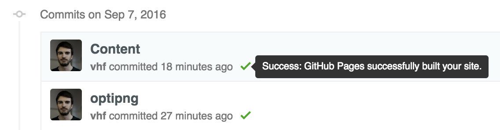

# How to modify this website

## Steps

1. Clone this repo or pull
1. Change the content of the `.md` or `.yml` files
1. Commit and push.

When you push, check that the website has been successfully generated:



## And also

* [Frontmatter](https://jekyllrb.com/docs/frontmatter/) is in [YAML](http://docs.ansible.com/ansible/YAMLSyntax.html)
* Content is in [Markdown](https://guides.github.com/features/mastering-markdown/).

Therefore you'll need to be able to use the basic elements of YAML and Markdown to modify the content. Creating a YAML list. Making paragraphs in Markdown. Etc.


# Projects

Projects are stored in `./_projects`. A sample project looks like this:

```yml
---
layout: project # don't touch this
permalink: /de/projects/logistic-transport # choose a URL
ref: logistic-transport # ref is used to tie together the language versions of a same content
lang: de # de, en, or fr

title: Logistic un Transport # page title
description: Projektbeschreibung mit Keywords. # project description
left: # left column
  logo:
    url: /assets/img/projects/project1-logo.png # project logo
    width: 150 # this line is optional, it'll default to 150
    height: 148 # this line is optional, it'll default to 1148
  paragraphs: # a list of paragraphs, each item will be wrapped in <p>, html allowed
    - a
    - b
    - c
  more_projects: # a list of other projects to display
    - title: SAMPLE PROJECT
      description: Projektbeschreibung Kurz mit Keywords hinterlegt.
      url: /projects/project-name
    - title: FAKE PROJECT
      description: Projektbeschreibung Kurz mit Keywords hinterlegt.
      url: /projects/project-name
right: # right column
  picture: # the picture to display on the right
    url: /assets/img/projects/project1-picture.png
    # width and height can be specified
  paragraphs: # a list of paragraphs to display on the right, under the picture. Can be omitted, this element is optional.
    - some optional paragraph
    - another optional paragraph
---
```

# Products and services

Products and services are stored in `./_products`. A sample page looks like this:

```yml
---
layout: product # don't touch this
permalink: /fr/installation-formation/ # choose a URL
ref: installation-training # has to be the same for all languages of a single content
lang: fr # as usual

title: Installation, exploitation et formation
description: Nous sommes des experts
---

## Some title

A paragraph.

* A list
* of items.
```

# Jobs

Job openings are stored in `./_jobs`. A sample page looks like this:

```yml
---
layout: job
ref: job-opening-1
lang: de
title: Software Engineer
---

Example text paragraph.

* bullet
* list

Another paragraph.

1. Ordered
2. List
3. Items
```

# Contacts, In the News, Team Members

Content for these pages come from `_data/*.yml`.

# Translatable strings, menu items, footer info, etc.

A bunch of things are configurable in `_config.yml`.
